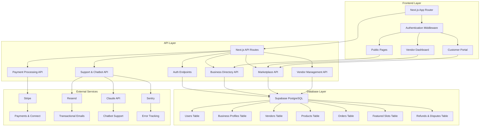
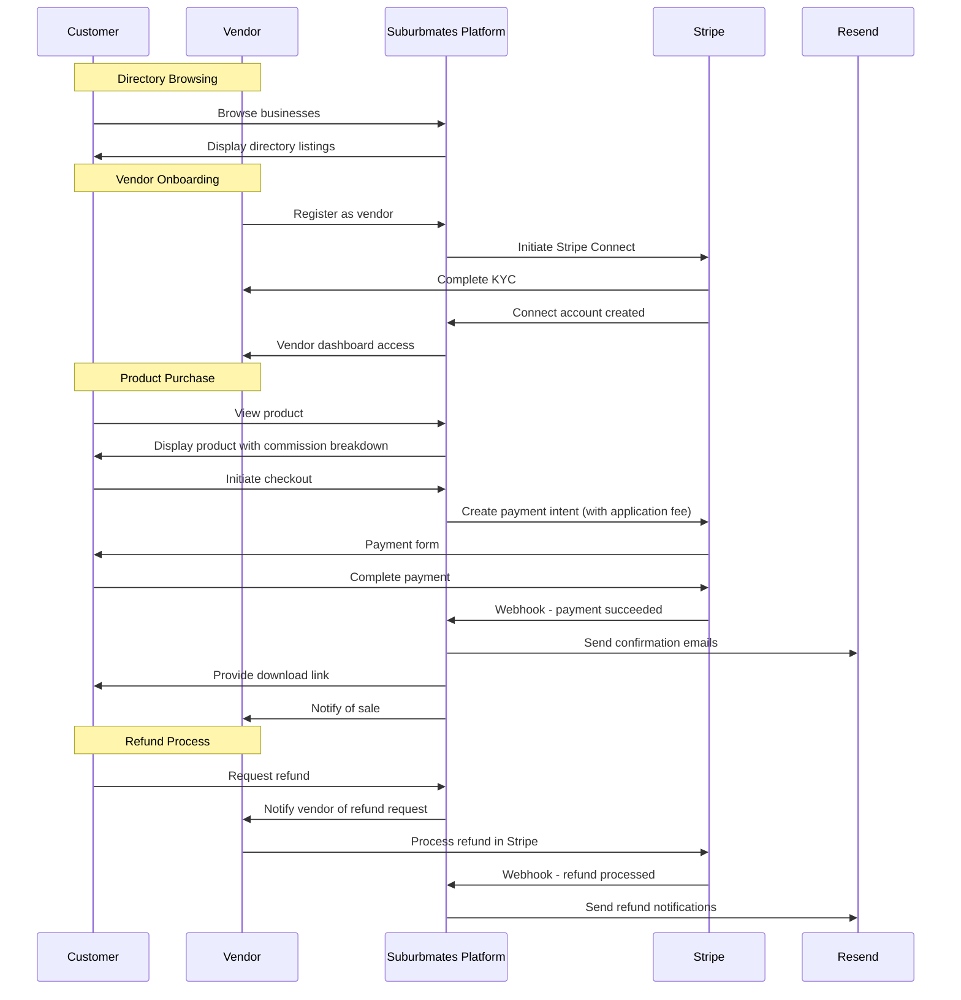

# Suburbmates V1.1 Prerequisites & Gaps Report + Implementation Plan

## Prerequisites & Gaps Report

### A. Already Configured (Verified in Code/Env)

#### ✅ Supabase

**Status: Configured + In Use**

- **Supabase Project:** Live project configured
  - URL: `https://hmmqhwnxylqcbffjffpj.supabase.co` ✅
  - Anon Key: Configured ✅
  - Service Role Key: Configured ✅
  - Database: Running PostgreSQL instance ✅
- **Usage in Code:**
  - [`src/lib/supabase.ts`](src/lib/supabase.ts) - Client configured ✅
  - [`src/lib/auth.ts`](src/lib/auth.ts) - Auth integration ✅
  - API routes using Supabase client ✅
  - RLS policies created in migration ✅

#### ✅ Stripe

**Status: Configured + Partially In Use**

- **Stripe Account:** Live keys configured
  - Secret Key: `<redacted>` ✅
  - Webhook Secret: `<redacted>` ✅
- **Usage in Code:**
  - [`src/lib/stripe.ts`](src/lib/stripe.ts) - Stripe client configured ✅
  - [`src/app/api/checkout/route.ts`](src/app/api/checkout/route.ts) - Checkout integration ✅
  - [`src/app/api/webhook/stripe/route.ts`](src/app/api/webhook/stripe/route.ts) - Webhook handler with secret ✅
- **Missing Configuration:**
  - [ ] `STRIPE_PRICE_PRO_MONTH` - Empty (needed for Pro tier)
  - [ ] `STRIPE_PRODUCT_PRO` - Empty
  - [ ] `STRIPE_CLIENT_ID` - Empty (Connect onboarding)

#### ✅ Platform Configuration

**Status: Configured**

- **Site URL:** `http://localhost:3000` ✅
- **Environment:** `development` ✅
- **ABR GUID:** `9c72aac8-8cfc-4a77-b4c9-18aa308669ed` ✅
- **Build Configuration:** Next.js 16.0.2 with TypeScript ✅

### B. External Dashboard Configuration Required

#### Stripe Dashboard Setup

**Status: Needs Verification**

- **Connect Settings:**
  - [ ] Connect Standard enabled in live mode
  - [ ] Application fees configured (6-8% commission)
  - [ ] OAuth redirect URLs configured
  - [ ] Webhook endpoints configured:
    - `https://suburbmates.com/api/webhooks/stripe` (production)
    - `http://localhost:3000/api/webhooks/stripe` (development)
- **Missing in Env:**
  - [ ] `STRIPE_CLIENT_ID` for OAuth flow
  - [ ] `STRIPE_PRICE_PRO_MONTH` for Pro subscriptions
  - [ ] `STRIPE_PRODUCT_PRO` for Pro tier product

#### Supabase Dashboard Setup

**Status: Likely Complete**

- **Verification Needed:**
  - [ ] RLS policies active and tested
  - [ ] Auth settings configured (email templates, allowed domains)
  - [ ] Storage buckets created if needed
  - [ ] Real-time subscriptions enabled

#### Vercel Deployment Setup

**Status: Needs Configuration**

- **Required Setup:**
  - [ ] Environment variables mirrored from `.env.local`
  - [ ] Build settings: Node.js 19+, npm
  - [ ] Custom domain: `suburbmates.com.au`
  - [ ] SSL certificate configuration

### C. Missing Services (Not Configured)

#### Email Service

**Status: Missing**

- **Required:** Resend account for transactional emails
- **Need:** API key and sender configuration
- **Impact:** Critical for user onboarding, order confirmations, notifications

#### Monitoring & Analytics

**Status: Missing**

- **Required Services:**
  - Sentry for error tracking
  - PostHog for analytics
  - Claude API for chatbot support
- **Impact:** Production monitoring and AI support

---

### D. Environment Variables Status

#### ✅ Supabase (Configured + In Use)

```bash
NEXT_PUBLIC_SUPABASE_URL=https://hmmqhwnxylqcbffjffpj.supabase.co
NEXT_PUBLIC_SUPABASE_ANON_KEY=your-anon-key
SUPABASE_SERVICE_ROLE_KEY=your-service-role-key
```

**Status:** ✅ Configured + In Use (verified in [`src/lib/supabase.ts`](src/lib/supabase.ts), [`src/lib/auth.ts`](src/lib/auth.ts), API routes)

#### ✅ Stripe (Configured + Partially In Use)

```bash
STRIPE_SECRET_KEY=sk_live_... # set in local env, not committed
STRIPE_WEBHOOK_SECRET=whsec_... # set in local env, not committed
STRIPE_PRICE_PRO_MONTH=        # Empty - needed for Pro tier
STRIPE_PRODUCT_PRO=           # Empty - needed for Pro tier
STRIPE_CLIENT_ID=           # Empty - needed for Connect onboarding
```

**Status:** ✅ Keys configured, ⚠️ Missing Pro tier and Connect config (verified in [`src/app/api/checkout/route.ts`](src/app/api/checkout/route.ts), [`src/app/api/webhook/stripe/route.ts`](src/app/api/webhook/stripe/route.ts))

#### ✅ Platform Configuration (Configured)

```bash
NEXT_PUBLIC_SITE_URL=http://localhost:3000
SUBURBMATES_ENV=development
ABR_GUID=9c72aac8-8cfc-4a77-b4c9-18aa308669ed
```

**Status:** ✅ Configured (verified in use)

#### ❌ Missing Services (Not Configured)

```bash
RESEND_API_KEY=re_xxxxxxxxxxxxx          # Email service
CLAUDE_API_KEY=your-claude-api-key       # AI chatbot
SENTRY_DSN=https://your-sentry-dsn@sentry.io/project  # Error tracking
POSTHOG_API_KEY=your-posthog-key         # Analytics
```

**Status:** ❌ Not configured (needed for production)

---

### E. Business Decisions Still Needed

#### 1. **Commission Rate Structure** ✅ RESOLVED

- **Status:** Configured in checkout flow
- **Current:** 6-8% range mentioned in docs, needs exact split
- **Action:** Decide exact Basic vs Pro commission rates
- **Impact:** Affects vendor pricing and platform revenue

#### 2. **Pro Tier Pricing** ⚠️ PARTIALLY CONFIGURED

- **Missing:** `STRIPE_PRICE_PRO_MONTH` and `STRIPE_PRODUCT_PRO` in env
- **Status:** $20/month suggested in docs
- **Action:** Set Pro subscription price and create Stripe product
- **Impact:** Blocks Pro tier upgrades

#### 3. **Storage Quotas** ✅ DOCUMENTED

- **Status:** Referenced in types and docs (Basic 5GB, Pro 10GB)
- **Action:** Implement quota enforcement in business logic
- **Impact:** Affects product upload validation

#### 4. **LGA Taxonomy** ✅ IMPLEMENTED

- **Status:** Hardcoded in migration, appears complete
- **Action:** Verify LGA list matches official sources
- **Impact:** Directory browsing and featured slots

#### 5. **Featured Slot Pricing** ⚠️ CONFIGURATION NEEDED

- **Status:** $20/month mentioned in docs
- **Action:** Finalize pricing and configure in Stripe
- **Impact:** Blocks featured slot purchases

#### 6. **Refund Policy Communication** ⚠️ PARTIALLY RESOLVED

- **Status:** Framework exists in webhook handler
- **Action:** Finalize legal messaging for vendor-owned refunds
- **Impact:** Customer-facing refund forms

---

### F. Technical Gaps (Code vs Docs)

#### 1. **Schema Mismatches** ✅ MAJOR GAPS IDENTIFIED

**Status: Configured but needs updates**

**Current vs Required:**

```sql
-- Current (in .env.local + migrations)
Supabase project: ✅ Configured
Database schema: ✅ Created (migrations 001, 002)
RLS policies: ✅ Created

-- Missing from V1.1 requirements:
business_profiles table: ❌ Not in current schema
vendor_status field: ❌ Missing (docs specify vendor_status, code uses tier)
ABN verification integration: ❌ Not implemented
```

#### 2. **API Endpoints Status**

**Status: Partially Implemented**

**Completed:**

- ✅ `POST /api/auth/signup` - User registration
- ✅ `POST /api/auth/login` - User login
- ✅ `POST /api/auth/create-vendor` - Vendor creation
- ✅ `POST /api/checkout` - Stripe checkout
- ✅ `POST /api/webhooks/stripe` - Webhook handling

**Missing:**

- ❌ `GET /api/business` - Business directory
- ❌ `GET /api/products` - Product browsing
- ❌ `POST /api/orders` - Order creation
- ❌ `POST /api/refunds` - Refund requests
- ❌ `POST /api/disputes` - Dispute escalation
- ❌ Vendor dashboard endpoints
- ❌ Featured slot management

#### 3. **Frontend Implementation Status**

**Status: Basic Stubs Only**

**Completed:**

- ✅ Basic Next.js app structure
- ✅ Auth API routes
- ✅ Checkout integration

**Missing:**

- ❌ Homepage with hero psychology
- ❌ Business directory pages
- ❌ Product detail pages
- ❌ Vendor dashboard
- ❌ Checkout flow UI
- ❌ Search and filtering

#### 4. **Authentication Integration Status**

**Status: Backend Configured, Frontend Missing**

**Completed:**

- ✅ Supabase client setup
- ✅ Auth management utilities
- ✅ API route protection
- ✅ Session handling

**Missing:**

- ❌ Frontend auth components
- ❌ Protected route wrappers
- ❌ Magic link email sending
- ❌ Vendor-specific auth flows

#### 5. **Stripe Integration Status**

**Status: Basic Integration**

**Completed:**

- ✅ Checkout session creation
- ✅ Webhook endpoint
- ✅ Webhook signature verification
- ✅ Application fee structure

**Missing:**

- ❌ Stripe Connect onboarding flow
- ❌ Vendor payout management
- ❌ Subscription billing (Pro tier)
- ❌ Refund processing (vendor-owned)
- ❌ Comprehensive webhook handling

#### 6. **Business Logic Gaps**

**Status: Major Implementation Needed**

**Missing Workflows:**

- ❌ Directory vs Marketplace separation
- ❌ Featured queue algorithm
- ❌ Vendor tier management
- ❌ ABN verification
- ❌ Refund/dispute notification system
- ❌ Rate limiting enforcement

---

## Phased Implementation Plan

### Phase 0 – Baseline & Validation

**Objective**
Establish development foundation and validate current state against V1.1 requirements.

**Inputs / Dependencies**

- [`v1.1-docs/00_README_MASTER_INDEX.md`](v1.1-docs/00_README_MASTER_INDEX.md) - Documentation structure
- [`v1.1-docs/01_STRATEGY/01.0_PROJECT_OVERVIEW.md`](v1.1-docs/01_STRATEGY/01.0_PROJECT_OVERVIEW.md) - Project scope and timeline
- [`v1.1-docs/03_ARCHITECTURE/03.0_TECHNICAL_OVERVIEW.md`](v1.1-docs/03_ARCHITECTURE/03.0_TECHNICAL_OVERVIEW.md) - Technical architecture
- All external accounts created (Stripe, Supabase, Vercel, Resend)

**Scope**

- Repository setup validation
- Development environment verification
- Documentation alignment check
- Gap analysis finalization

**Tasks (Granular)**

1. **Verify Current Configuration Status**

   - Confirm Supabase project is accessible and functional
   - Test Stripe API keys and webhook secret validation
   - Verify `.env.local` variables are properly loaded
   - Test existing API endpoints (auth, checkout, webhook)

2. **Validate External Dashboard Setup**

   - Check Stripe dashboard: Connect settings, webhook endpoints, application fees
   - Verify Supabase dashboard: RLS policies, auth settings, storage buckets
   - Set up Vercel project with environment variables from `.env.local`

3. **Complete Missing Service Setup**

   - Create Resend account for transactional emails
   - Set up Sentry for error tracking
   - Configure PostHog for analytics
   - Create Claude API account for chatbot

4. **Resolve Configuration Gaps**

   - Set `STRIPE_PRICE_PRO_MONTH` and `STRIPE_PRODUCT_PRO` values
   - Generate `STRIPE_CLIENT_ID` for Connect onboarding
   - Configure production environment variables

5. **Finalize Business Decisions**

   - Confirm exact commission rates (Basic vs Pro)
   - Approve Pro tier pricing ($20/month)
   - Finalize featured slot pricing and policies
   - Approve legal messaging for vendor-owned refunds

6. **Update Project Documentation**

   - Document current environment configuration
   - Create deployment checklist for missing services
   - Update architecture diagram with current state
   - Create service dependency map

7. **Set Up Development Infrastructure**
   - Configure project management tools (GitHub Projects, milestones)
   - Establish coding standards and review processes
   - Set up CI/CD pipeline with Vercel
   - Create testing and staging environments

**Definition of Done**

- [ ] All external accounts created and tested
- [ ] Local development environment working
- [ ] Documentation structure validated
- [ ] Gap analysis complete and approved
- [ ] Project management setup complete
- [ ] All team members have access to required tools

---

### Phase 1 – Infrastructure & Database

**Objective**
Establish robust foundation with complete database schema, authentication, and core API infrastructure.

**Inputs / Dependencies**

- Phase 0 completion
- All external accounts configured
- Environment variables available
- [`v1.1-docs/03_ARCHITECTURE/03.3_SCHEMA_REFERENCE.md`](v1.1-docs/03_ARCHITECTURE/03.3_SCHEMA_REFERENCE.md) for schema requirements

**Scope**

- Database schema finalization and migration
- Row Level Security (RLS) policies implementation
- Authentication system completion
- Core API infrastructure setup
- Development tooling and testing framework

**Out of Scope**

- Business logic workflows
- Frontend UI implementation
- Stripe Connect onboarding
- Payment processing

**Tasks (Granular)**

1. **Database Schema Implementation**

   - Create `business_profiles` table per V1.1 schema requirements
   - Add missing fields to existing tables (vendor_status, is_vendor, etc.)
   - Implement proper foreign key relationships
   - Add missing indexes for performance

2. **RLS Policies Enhancement**

   - Fix vendor status check logic in RLS policies
   - Implement proper directory vs marketplace access controls
   - Add real-time subscription permissions
   - Test all RLS policies thoroughly

3. **Authentication System**

   - Complete magic link email integration with Resend
   - Implement session management middleware
   - Create protected route components
   - Add role-based access control helpers

4. **Core API Infrastructure**

   - Set up API response formatting standards
   - Implement error handling middleware
   - Create database connection utilities
   - Add rate limiting infrastructure

5. **Testing & Validation**
   - Set up unit testing framework
   - Create database migration tests
   - Implement API endpoint testing
   - Add integration test structure

**Definition of Done**

- [ ] Complete V1.1 schema implemented and tested
- [ ] All RLS policies working correctly
- [ ] Authentication system fully functional
- [ ] Core API infrastructure in place
- [ ] Basic testing framework established
- [ ] CI/CD pipeline configured

**Risks & Mitigations**

- **Risk:** Schema changes breaking existing code
  - **Mitigation:** Use migration scripts and thorough testing
- **Risk:** RLS policies too restrictive
  - **Mitigation:** Implement gradual policy rollout with testing

---

### Phase 2 – Directory & Authentication

**Objective**
Implement complete directory functionality and robust authentication flows.

**Inputs / Dependencies**

- Phase 1 completion
- Database schema and RLS policies working
- Authentication infrastructure in place
- [`v1.1-docs/02_DESIGN_AND_UX/02.2_PAGE_MAPPING_AND_LAYOUTS.md`](v1.1-docs/02_DESIGN_AND_UX/02.2_PAGE_MAPPING_AND_LAYOUTS.md) for page requirements

**Scope**

- Business directory API endpoints
- Business profile management
- User registration and onboarding
- Directory browsing and search
- Basic frontend pages

**Out of Scope**

- Marketplace product functionality
- Payment processing
- Featured slots
- Vendor-specific workflows

**Tasks (Granular)**

1. **Business Directory API**

   - `GET /api/business` - List businesses with search/filter
   - `POST /api/business` - Create business profile
   - `GET /api/business/[id]` - View business details
   - `PUT /api/business/[id]` - Update business profile
   - `GET /api/business/[id]/products` - List vendor products

2. **Authentication Workflows**

   - Magic link signup with email verification
   - Business profile creation flow
   - Vendor upgrade workflow (directory → vendor)
   - Session management and validation
   - Passwordless authentication flows

3. **Directory Frontend**

   - Homepage with hero psychology implementation
   - Business directory browse page
   - Business profile detail pages
   - Search and filtering interface
   - Vendor profile display (non-selling)

4. **Business Logic**

   - Directory-only vs vendor status management
   - Business profile validation and approval
   - LGA-based filtering and organization
   - Category taxonomy implementation
   - Profile completeness tracking

5. **Testing & Integration**
   - End-to-end directory workflows
   - Search functionality testing
   - Authentication flow validation
   - Mobile responsive testing
   - Performance optimization

**Definition of Done**

- [ ] Complete directory API functional
- [ ] Business profile creation working
- [ ] Directory browsing and search operational
- [ ] Homepage with hero psychology implemented
- [ ] Authentication flows complete
- [ ] All directory pages responsive and tested

**Risks & Mitigations**

- **Risk:** Complex hero psychology implementation delays
  - **Mitigation:** Implement basic version first, enhance iteratively
- **Risk:** Search performance issues
  - **Mitigation:** Implement proper indexing and caching strategies

---

### Phase 3 – Vendor Onboarding & Product Management

**Objective**
Enable vendors to onboard, create products, and manage their marketplace presence.

**Inputs / Dependencies**

- Phase 2 completion
- Directory functionality working
- Authentication system stable
- [`v1.1-docs/05_FEATURES_AND_WORKFLOWS/05.0_VENDOR_WORKFLOWS.md`](v1.1-docs/05_FEATURES_AND_WORKFLOWS/05.0_VENDOR_WORKFLOWS.md) for workflow requirements

**Scope**

- Vendor onboarding and Stripe Connect integration
- Product creation and management API
- Vendor dashboard implementation
- File upload and storage management
- Tier management and ABN verification

**Out of Scope**

- Payment processing and checkout
- Featured slots and queue management
- Refund and dispute workflows
- Customer-facing marketplace browsing

**Tasks (Granular)**

1. **Stripe Connect Integration**

   - Vendor Stripe Connect onboarding flow
   - Connected account management
   - KYC compliance handling
   - Payout configuration and testing
   - Webhook setup for Connect events

2. **Product Management API**

   - `POST /api/products` - Create product with file upload
   - `GET /api/products` - Product search and listing
   - `PUT /api/products/[id]` - Update product
   - `DELETE /api/products/[id]` - Archive product
   - File upload and storage management

3. **Vendor Dashboard**

   - Vendor dashboard home with stats
   - Product management interface
   - File upload and storage quota display
   - Vendor profile and settings
   - Tier management and ABN verification

4. **Business Logic Implementation**

   - Storage quota enforcement
   - Tier-based product limits
   - ABN verification integration
   - Vendor status management (active/suspended)
   - Product approval and publishing workflow

5. **Frontend Components**
   - Product creation form with file upload
   - Product listing and management tables
   - Dashboard analytics and reporting
   - File management interface
   - Vendor profile editing

**Definition of Done**

- [ ] Vendor onboarding with Stripe Connect working
- [ ] Product creation and management functional
- [ ] Vendor dashboard operational
- [ ] File upload and storage working
- [ ] Tier management and ABN verification complete
- [ ] All vendor workflows tested end-to-end

**Risks & Mitigations**

- **Risk:** Stripe Connect complexity causing delays
  - **Mitigation:** Use Stripe's standard onboarding flow, test thoroughly in sandbox
- **Risk:** File upload security vulnerabilities
  - **Mitigation:** Implement proper validation, virus scanning, and access controls

---

### Phase 4 – Marketplace & Checkout

**Objective**
Implement complete marketplace functionality with secure checkout and payment processing.

**Inputs / Dependencies**

- Phase 3 completion
- Vendor and product management working
- Stripe Connect integration stable
- [`v1.1-docs/04_API/04.0_COMPLETE_SPECIFICATION.md`](v1.1-docs/04_API/04.0_COMPLETE_SPECIFICATION.md) for API requirements

**Scope**

- Product marketplace browsing
- Shopping cart and checkout flow
- Stripe payment processing
- Order management
- Commission calculation and tracking

**Out of Scope**

- Featured slots and queue management
- Refund and dispute workflows
- Advanced analytics
- Customer account management

**Tasks (Granular)**

1. **Marketplace API**

   - `GET /api/products` - Marketplace product listing
   - `POST /api/orders` - Create orders
   - `GET /api/orders/[id]` - Order details
   - `GET /api/orders` - Order history (vendor/customer)
   - Commission calculation and application

2. **Checkout Implementation**

   - Stripe Checkout session creation
   - Commission transparency display
   - Order confirmation and tracking
   - Payment status management
   - Download link generation and management

3. **Marketplace Frontend**

   - Product browsing with filters
   - Product detail pages with purchase options
   - Shopping cart interface
   - Checkout flow with Stripe integration
   - Order confirmation and download pages

4. **Payment Processing**

   - Stripe webhook handling (charge.succeeded, etc.)
   - Order status updates
   - Commission calculation and tracking
   - Vendor payout calculation
   - Transaction logging and audit trails

5. **Business Logic**
   - Commission rate application (Basic 8%, Pro 6%)
   - Order lifecycle management
   - Payment status tracking
   - Download link expiration
   - Customer/vendor notification system

**Definition of Done**

- [ ] Complete marketplace browsing functional
- [ ] Checkout and payment processing working
- [ ] Order management system operational
- [ ] Commission calculation accurate
- [ ] All payment flows tested in sandbox
- [ ] Download and fulfillment working

**Risks & Mitigations**

- **Risk:** Payment processing errors causing revenue loss
  - **Mitigation:** Extensive testing in sandbox, proper error handling, transaction logging
- **Risk:** Commission calculation errors
  - **Mitigation:** Multiple calculation validation, audit trails, reconciliation processes

---

### Phase 5 – Featured Slots & Queue Management

**Objective**
Implement featured slot purchasing and FIFO queue management system.

**Inputs / Dependencies**

- Phase 4 completion
- Marketplace and payments working
- Vendor dashboard functional
- [`v1.1-docs/03_ARCHITECTURE/03.0_TECHNICAL_OVERVIEW.md`](v1.1-docs/03_ARCHITECTURE/03.0_TECHNICAL_OVERVIEW.md) §§270-313 for queue algorithm

**Scope**

- Featured slot purchase system
- Queue position calculation and management
- Featured slot display and management
- Automated queue notifications
- LGA-based slot allocation

**Out of Scope**

- Refund and dispute workflows
- Advanced analytics and reporting
- Customer support integration
- Marketing automation

**Tasks (Granular)**

1. **Featured Slot API**

   - `POST /api/featured/purchase` - Purchase featured slot
   - `GET /api/featured/availability` - Check slot availability
   - `GET /api/featured/queue` - Queue position and status
   - `POST /api/featured/join-queue` - Join queue for featured slot
   - Queue position calculation and updates

2. **Queue Algorithm Implementation**

   - ROW_NUMBER() based position calculation
   - Estimated wait time calculation
   - Queue promotion logic when slots open
   - 48-hour payment deadline enforcement
   - Automated queue position updates

3. **Featured Management Frontend**

   - Featured slot status dashboard
   - Queue position display with countdowns
   - Featured slot purchase interface
   - Queue management and notifications
   - LGA-based slot availability display

4. **Business Logic**

   - 5 slots per LGA enforcement
   - 30-day featured period management
   - FIFO queue progression logic
   - Automated notifications (7/3/1 day reminders)
   - Payment deadline and slot reassignment

5. **Integration & Testing**
   - End-to-end featured purchase flow
   - Queue algorithm accuracy testing
   - Notification system validation
   - Multi-vendor queue scenarios
   - Payment deadline enforcement

**Definition of Done**

- [ ] Featured slot purchase system working
- [ ] Queue algorithm calculating positions correctly
- [ ] Automated notifications functional
- [ ] Featured slot display working
- [ ] All edge cases tested (full queues, payment deadlines)

**Risks & Mitigations**

- **Risk:** Complex queue algorithm implementation errors
  - **Mitigation:** Thorough unit testing of position calculations, manual verification
- **Risk:** Payment deadline enforcement complexity
  - **Mitigation:** Automated cron jobs, clear user notifications, graceful handling

---

### Phase 6 – Refunds, Disputes & Support

**Objective**
Implement vendor-owned refund workflows and chatbot-heavy support system.

**Inputs / Dependencies**

- Phase 5 completion
- Marketplace and payments stable
- Vendor dashboard complete
- [`v1.1-docs/07_QUALITY_AND_LEGAL/07.1_LEGAL_COMPLIANCE_AND_DATA.md`](v1.1-docs/07_QUALITY_AND_LEGAL/07.1_LEGAL_COMPLIANCE_AND_DATA.md) for legal requirements

**Scope**

- Refund request and approval workflows
- Dispute escalation and resolution
- Chatbot support system
- Vendor notification system
- Risk monitoring and enforcement

**Out of Scope**

- Platform-issued refunds (vendors handle directly in Stripe)
- SLA commitments or guarantees
- Manual customer support (chatbot-only)
- Advanced analytics and reporting

**Tasks (Granular)**

1. **Refund Workflow API**

   - `POST /api/orders/[id]/refund` - Request refund
   - `GET /api/refunds/[id]` - Refund details
   - `POST /api/refunds/[id]/approve` - Vendor approval
   - `POST /api/refunds/[id]/reject` - Vendor rejection
   - Stripe refund webhook handling

2. **Dispute Management**

   - `POST /api/disputes` - Escalate refund to dispute
   - `GET /api/disputes` - Dispute list and details
   - `PUT /api/disputes/[id]/resolve` - Admin resolution
   - Evidence upload and management
   - Dispute outcome tracking

3. **Chatbot Support System**

   - FAQ RAG system with Claude integration
   - Billing lookup integration (Stripe read-only)
   - Technical issue lookup (Sentry read-only)
   - Support ticket escalation
   - Rate limiting and cost management

4. **Risk Monitoring**

   - Chargeback rate calculation and monitoring
   - Vendor risk scoring
   - Automated warnings and restrictions
   - Suspension and appeal workflows
   - Policy enforcement automation

5. **Frontend Components**
   - Refund request forms
   - Refund status tracking
   - Dispute resolution interface
   - Chatbot widget integration
   - Support ticket management

**Definition of Done**

- [ ] Refund workflow operational (vendor-owned)
- [ ] Dispute escalation and resolution working
- [ ] Chatbot support resolving 70%+ of queries
- [ ] Risk monitoring and enforcement active
- [ ] All legal compliance requirements met
- [ ] Vendor notification system functional

**Risks & Mitigations**

- **Risk:** Legal compliance issues with refund handling
  - **Mitigation:** Strict vendor-owned model, clear documentation, legal review
- **Risk:** Chatbot support insufficient for complex issues
  - **Mitigation:** Clear escalation paths, comprehensive FAQ training, human fallback

---

### Phase 7 – Quality, Testing & Deployment

**Objective**
Ensure production-ready quality with comprehensive testing, monitoring, and deployment.

**Inputs / Dependencies**

- All previous phases complete
- Full functionality implemented
- [`v1.1-docs/07_QUALITY_AND_LEGAL/07.0_QA_AND_TESTING_STRATEGY.md`](v1.1-docs/07_QUALITY_AND_LEGAL/07.0_QA_AND_TESTING_STRATEGY.md) for testing requirements

**Scope**

- Comprehensive testing (unit, integration, e2e)
- Performance optimization and monitoring
- Security audit and penetration testing
- Documentation completion
- Production deployment and monitoring

**Out of Scope**

- New feature development
- Major architectural changes
- Third-party integrations beyond scope
- Marketing and customer acquisition

**Tasks (Granular)**

1. **Testing & Quality Assurance**

   - Unit tests for all components and functions
   - Integration tests for API endpoints
   - End-to-end tests for critical user journeys
   - Performance testing (Lighthouse 90+ target)
   - Security testing and RLS validation

2. **Monitoring & Observability**

   - Sentry error tracking and alerting
   - Performance monitoring setup
   - Business metrics tracking
   - Uptime monitoring and alerts
   - Database performance optimization

3. **Documentation & Compliance**

   - User guide documentation
   - API documentation
   - Admin guide and runbooks
   - Legal compliance validation
   - Accessibility audit (WCAG 2.1 AA)

4. **Deployment & Operations**

   - Production environment setup
   - CI/CD pipeline finalization
   - Database backup and recovery procedures
   - Incident response runbooks
   - Performance optimization

5. **Launch Preparation**
   - Load testing and capacity planning
   - Security audit completion
   - Documentation finalization
   - Team training and handover
   - Go-live checklist validation

**Definition of Done**

- [ ] All testing requirements met (>80% coverage)
- [ ] Performance targets achieved (Lighthouse 90+)
- [ ] Security audit passed
- [ ] Documentation complete
- [ ] Production deployment successful
- [ ] Monitoring and alerting active
- [ ] Go-live checklist 100% complete

**Risks & Mitigations**

- **Risk:** Production issues due to incomplete testing
  - **Mitigation:** Comprehensive testing strategy, staging environment validation
- **Risk:** Performance issues under load
  - **Mitigation:** Load testing, performance optimization, monitoring setup

---

## System Architecture Overview



## Data Flow Diagram



## Implementation Timeline

| Phase | Duration | Primary Focus        | Key Deliverables                   |
| ----- | -------- | -------------------- | ---------------------------------- |
| 0     | 1 week   | Setup & Validation   | Environment, accounts, planning    |
| 1     | 2 weeks  | Infrastructure       | Database, auth, API foundation     |
| 2     | 2 weeks  | Directory            | Business profiles, browsing        |
| 3     | 3 weeks  | Vendor Onboarding    | Stripe Connect, product management |
| 4     | 3 weeks  | Marketplace          | Checkout, payments, orders         |
| 5     | 2 weeks  | Featured Slots       | Queue system, featured management  |
| 6     | 2 weeks  | Support & Compliance | Refunds, disputes, chatbot         |
| 7     | 2 weeks  | Quality & Deployment | Testing, monitoring, launch        |

**Total Estimated Duration:** 17 weeks (≈4 months)

**Critical Path Dependencies:**

- Phase 1 must complete before any user-facing functionality
- Phase 3 requires Phase 1 (Stripe Connect needs auth)
- Phase 4 requires Phase 3 (marketplace needs vendors)
- Phase 6 can run in parallel with Phase 5

## Success Metrics & Go/No-Go Gates

### Technical Metrics

- **Lighthouse Score:** 90+ (performance, accessibility, SEO)
- **Test Coverage:** 80%+ (unit + integration)
- **Error Rate:** <0.1% in production
- **API Response Time:** <200ms (p95)
- **Uptime:** 99.9% target

### Business Metrics

- **Vendor Count:** 50+ active vendors by launch
- **Product Count:** 200+ products listed
- **Transaction Volume:** $5K+ monthly GMV
- **Commission Revenue:** $400+ monthly
- **User Satisfaction:** 4.0+ rating

### Go/No-Go Gates

Each phase ends with validation gates:

- [ ] All critical features functional
- [ ] Test coverage targets met
- [ ] Performance benchmarks achieved
- [ ] Security review passed
- [ ] Documentation complete
- [ ] Team sign-off obtained

## Risk Assessment & Mitigation

### High Risk Items

1. **Stripe Integration Complexity**
   - _Mitigation:_ Use standard flows, extensive sandbox testing
2. **Legal Compliance (Refunds/Disputes)**
   - _Mitigation:_ Vendor-owned model, legal review, clear documentation
3. **Performance Under Load**
   - _Mitigation:_ Load testing, optimization, monitoring

### Medium Risk Items

1. **Queue Algorithm Complexity**
   - _Mitigation:_ Thorough testing, manual verification
2. **Multi-vendor Coordination**
   - _Mitigation:_ Clear communication, documentation, training

### Low Risk Items

1. **UI/UX Polish**
   - _Mitigation:_ Iterative design, user testing
2. **Third-party Service Dependencies**
   - _Mitigation:_ Monitoring, fallback plans, SLA reviews

---

**Document Status:** ✅ Ready for Implementation  
**Last Updated:** November 13, 2025  
**Next Review:** Upon Phase 0 completion
